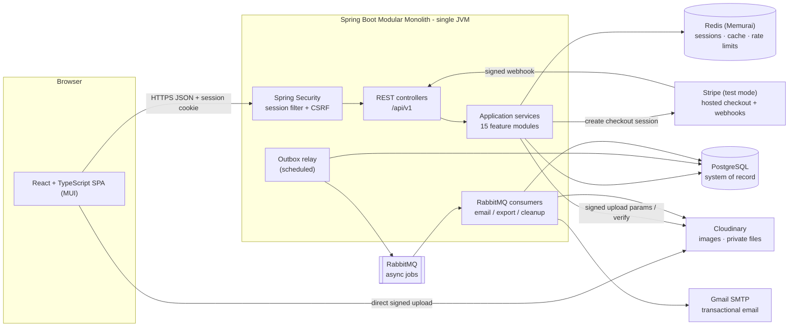
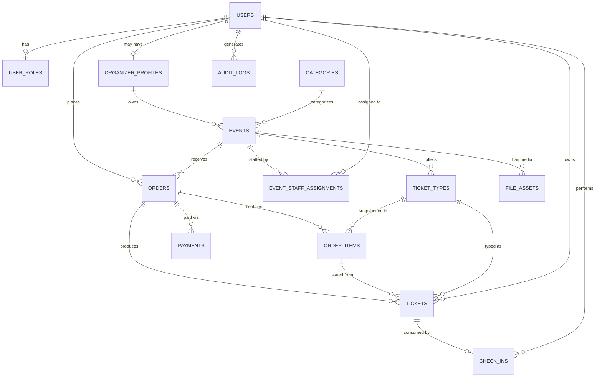

# Architecture — Event Management & Ticketing Platform

**Version:** 1.0-draft · **Date:** 2026-07-16 · **Status:** Pending sign-off (Phase 2, Step 2.9)
**Related docs:** [requirements.md](requirements.md) · [assumptions.md](assumptions.md) · [mvp-scope.md](mvp-scope.md) · [use-cases.md](use-cases.md) · [adr/](adr/) · [api/vertical-slice.md](api/vertical-slice.md)

---

## 1. System context & flows

### 1.1 Container diagram



**Trust boundaries:** the browser and all external services are untrusted. Every request re-authenticates via session; every webhook is signature-verified; every Cloudinary upload is pre-authorized and post-verified.

### 1.2 Request lifecycle (synchronous)

1. SPA sends HTTPS request with session cookie (+ CSRF token on writes).
2. Correlation-ID filter assigns/propagates a request ID (`X-Request-Id`).
3. Spring Security resolves the session from Redis; loads user + roles.
4. Rate-limit filter checks Bucket4j buckets in Redis (429 on breach).
5. Controller validates the request DTO (Bean Validation).
6. Application service enforces role + ownership, runs domain rules.
7. Repository work executes inside a transaction; outbox rows are written in the same transaction where async follow-up is needed.
8. Commit → response DTO → structured log line with request ID, duration, status.

### 1.3 Authentication & session flow

Login verifies status + password hash → session created in Redis (rotated ID) → secure/HTTP-only/SameSite=Lax cookie. Logout and suspension delete the session server-side. No JWTs — see [ADR-0002](adr/0002-redis-sessions-over-jwt.md).

### 1.4 File upload flow (direct-to-Cloudinary)

1. SPA: `POST /files/upload-requests` (purpose, MIME, size).
2. Backend validates ownership + purpose + MIME + size → creates `file_assets` row (status `PENDING`, random `public_id`) → returns signed upload params.
3. Browser uploads bytes **directly to Cloudinary** (backend never proxies bytes).
4. SPA: `POST /files/{fileId}/complete` → backend verifies the asset via Cloudinary Admin API (exists, MIME, size) → status `READY` → attaches to entity.
5. Orphaned `PENDING` rows are cleaned by an async job.

### 1.5 Asynchronous flow (transactional outbox → RabbitMQ)

1. A business transaction inserts an `outbox_jobs` row (job type, payload, idempotency key) and commits atomically with the business change.
2. The outbox relay polls every ~2 s: claims `PENDING` rows with `FOR UPDATE SKIP LOCKED`, publishes to RabbitMQ with publisher confirms, marks `SENT`.
3. Consumers process idempotently (job key checked before side effects), then ack.
4. Failures → retry queues with backoff; exhausted retries → dead-letter queue + alert metric. Details in §6.

---

## 2. Module map

### 2.1 Backend modules (package-by-feature)

```text
com.ticketing
├── shared          // error envelope, pagination, correlation ID, ports (Clock, IdGenerator), base types
├── auth            // registration, login/logout, sessions, password reset, email verification
├── user            // profile, /users/me, account soft-delete
├── organizer       // organizer profile management
├── event           // event lifecycle: draft → review → published → cancelled/completed
├── tickettype      // ticket type config + inventory counters
├── order           // order creation, totals, idempotency, expiration
├── payment         // Stripe adapter, checkout sessions, webhook processing
├── ticket          // ticket generation, QR, PDF, viewing
├── checkin         // validation + atomic check-in
├── notification    // outbox relay, RabbitMQ consumers, email templates
├── file            // Cloudinary port/adapter, upload authorization, file_assets
├── reporting       // organizer summaries, admin overview
├── admin           // user/event moderation, review queue, audit viewer
└── audit           // append-only audit log writer + query API
```

| Module | Owns tables | May call (application services of) |
|---|---|---|
| auth | password/verification tokens | user, notification, audit |
| user | users, user_roles | audit |
| organizer | organizer_profiles | user, audit |
| event | events, categories, event_staff_assignments | organizer, tickettype, file, notification, audit |
| tickettype | ticket_types | event |
| order | orders, order_items | event, tickettype, ticket, notification, audit |
| payment | payments | order, notification, audit |
| ticket | tickets | order, event |
| checkin | check_ins | ticket, event, audit |
| notification | outbox_jobs | (consumes; sends via EmailSender) |
| file | file_assets | audit |
| reporting | — (reads others' tables via queries) | event, order |
| admin | — | user, event, audit, notification |
| audit | audit_logs | — |
| shared | — | — (depends on nothing) |

**Dependency rules**
- Controllers call only their own module's application service.
- Cross-module calls go through application services — never another module's repository or entity.
- JPA entities never cross module boundaries; DTOs only at boundaries.
- `shared` depends on no feature module; every module may depend on `shared`.
- Enforced by convention now; ArchUnit rules optional post-MVP.

### 2.2 Frontend structure

```text
src/
├── api/            // typed API client, error mapping, CSRF handling
├── auth/           // session context, route guards, role-based nav
├── features/
│   ├── events/     // public search + detail
│   ├── orders/     // checkout flows
│   ├── tickets/    // my tickets, QR display, PDF download
│   ├── organizer/  // event editor, ticket types, dashboard, exports
│   ├── checkin/    // staff scanner (camera + manual code)
│   └── admin/      // review queue, moderation, audit viewer
├── components/     // shared MUI-based components
├── routes.tsx
└── theme.ts
```

---

## 3. Integration ports & adapters

All provider code lives in infrastructure adapters behind these interfaces. Rule: **no provider SDK types outside its adapter package.**

| Port | Adapter (prod) | Timeouts | On failure | Test substitute |
|---|---|---|---|---|
| `PaymentGateway` | `StripePaymentGateway` | connect 3 s / read 10 s | 503 `PAYMENT_PROVIDER_UNAVAILABLE`; order stays `PENDING_PAYMENT`; never fake success | `FakePaymentGateway` (scriptable outcomes) |
| `EmailSender` | `SmtpEmailSender` (Gmail) | connect 5 s / read 10 s | throw → consumer retry w/ backoff → DLQ | `RecordingEmailSender` (captures messages) |
| `ObjectStorage` | `CloudinaryObjectStorage` | connect 3 s / read 10 s | upload-auth → 503; deletes retried via queue | `InMemoryObjectStorage` |
| `QrCodeGenerator` | `ZxingQrCodeGenerator` | n/a (local lib) | exception → 500 (should never happen) | real implementation (deterministic) |
| `MessagePublisher` | `RabbitMessagePublisher` | confirm wait 5 s | outbox row stays `PENDING`; relay retries | `RecordingPublisher` |
| `Clock` | `Clock.systemUTC()` | n/a | n/a | fixed/offset clock |
| `IdGenerator` | UUID v4 | n/a | n/a | sequence-based fake |

```java
public interface PaymentGateway {
    CheckoutSession createCheckoutSession(CheckoutRequest request);        // order id, amount, currency, URLs
    VerifiedWebhookEvent parseAndVerify(String payload, String signature); // throws WebhookVerificationException
}

public interface EmailSender {
    void send(EmailMessage message);                                       // called only from consumers
}

public interface ObjectStorage {
    SignedUpload createSignedUpload(UploadSpec spec);                      // folder, publicId, constraints
    StoredAsset verify(String publicId);                                   // Admin API check after upload
    void delete(String publicId);
    URI signedDownloadUrl(String publicId, Duration ttl);                  // private assets only
}

public interface QrCodeGenerator {
    byte[] renderPng(String payload, int sizePx);
}
```

---

## 4. Security model

### 4.1 Sessions
Spring Security + Spring Session Data Redis. Session ID rotated at login; invalidated at logout, password reset, and suspension. Cookie: `Secure`, `HttpOnly`, `SameSite=Lax`. Idle timeout 24 h (default from [assumptions.md §4](assumptions.md)).

### 4.2 Role matrix

| Action | Attendee | Organizer | Staff | Admin |
|---|---|---|---|---|
| Browse / buy | ✅ | ✅ | ✅ | ✅ |
| Create / edit events | — | owned only | — | ✅ |
| Submit event for review | — | owned only | — | ✅ |
| Approve / reject events | — | — | — | ✅ |
| View attendees / export CSV | — | owned only | assigned event | ✅ |
| Check in tickets | — | owned event | assigned event | ✅ |
| Suspend users / view audit logs | — | — | — | ✅ |

### 4.3 Ownership enforcement pattern
Every application-service method that touches an owned resource loads the resource **and** verifies the owner in one step; absence and denial both return 404 to prevent resource-existence probing:

```java
Event event = eventRepository.findByIdAndOrganizerUserId(eventId, currentUser.id())
        .orElseThrow(ResourceNotFoundException::new); // 404, not 403
```

### 4.4 CSRF & CORS
- CSRF: cookie-to-header token (`XSRF-TOKEN` cookie → `X-XSRF-TOKEN` header) required on all cookie-authenticated writes. Webhook endpoint exempt (signature-verified instead, no session).
- CORS: allowlist = SPA dev origin (`http://localhost:5173`) and production origin only; credentials enabled; no wildcards.

### 4.5 Rate-limit map (Bucket4j + Redis)

| Endpoint | Limit |
|---|---|
| `POST /auth/login` | 5/min per IP · 10/h per account |
| `POST /auth/register` | 3/h per IP |
| `POST /auth/password/forgot` | 3/h per IP+email |
| `POST /orders` | 10/min per user |
| `POST /orders/{id}/checkout` | 5/min per user |
| `POST /check-ins*` | 100/min per staff user |
| `POST /files/upload-requests` | 10/h per user |
| `/admin/**` | 60/min per admin |

Breach → 429 + `Retry-After`; counted in metrics.

### 4.6 Threat model

| Threat | Primary defense | Backstop |
|---|---|---|
| Forged ticket | 256-bit random token, only hash stored | server-side validation only |
| Ticket reuse | check-in transaction | **unique `check_ins.ticket_id`** |
| Overselling | conditional inventory UPDATE | `quantity_sold <= quantity_total` check constraint |
| Payment spoofing/replay | Stripe signature verification | unique `(provider, provider_payment_id)` + amount/currency match |
| IDOR | service-layer ownership checks (§4.3) | API tests per boundary |
| Account takeover | adaptive hashing, rate limits, generic errors | session rotation, audit log |
| Malicious upload | MIME/size validation + Cloudinary verify | random keys, image-only delivery |
| Data exfiltration via export | role check + audit log | private asset + short-TTL signed URL |

---

## 5. Data model

### 5.1 ER diagram



### 5.2 Tables (all: UUID PK, `created_at`/`updated_at` TIMESTAMPTZ; `version BIGINT` where noted)

| Table | Key fields | Constraints & notes |
|---|---|---|
| `users` | email, password_hash, display_name, status, email_verified_at, deleted_at, version | unique `lower(email)`; status ∈ ACTIVE/SUSPENDED/DELETED; soft delete |
| `user_roles` | user_id, role | unique (user_id, role); role ∈ ATTENDEE/ORGANIZER/STAFF/ADMIN |
| `organizer_profiles` | user_id, org_name, description, contact_email, status, deleted_at | unique user_id (one profile per user); soft delete |
| `categories` | name, slug, active | unique slug; seeded by migration |
| `events` | organizer_id, category_id, slug, title, description, event_type, venue fields, timezone, starts_at, ends_at, registration_opens_at, registration_closes_at, capacity, status, submitted_at, published_at, cancelled_at, rejection_reason, banner_file_id, version | unique slug; status ∈ DRAFT/PENDING_REVIEW/REJECTED/PUBLISHED/CANCELLED/COMPLETED; checks: ends_at > starts_at, capacity > 0; venue fields required when event_type = PHYSICAL; soft delete for drafts only |
| `ticket_types` | event_id, name, description, price NUMERIC(12,2), currency CHAR(3), quantity_total, quantity_sold, max_per_order, sales_start_at, sales_end_at, status, version | checks: price ≥ 0, **quantity_sold ≤ quantity_total**, max_per_order > 0; currency fixed 'LKR' |
| `event_staff_assignments` | event_id, user_id, assigned_by | unique (event_id, user_id) |
| `orders` | order_number, user_id, event_id, status, currency, subtotal, fees, grand_total, idempotency_key, expires_at, confirmed_at, cancelled_at, version | unique order_number; **unique (user_id, idempotency_key)**; status ∈ PENDING_PAYMENT/CONFIRMED/CANCELLED/EXPIRED; totals server-calculated; never soft-deleted |
| `order_items` | order_id, ticket_type_id, ticket_type_name, unit_price, quantity, line_total | name + price copied deliberately (financial history) |
| `payments` | order_id, provider, provider_payment_id, provider_event_id, status, amount, currency, failure_code, paid_at | **unique (provider, provider_payment_id)**; status ∈ CREATED/SUCCEEDED/FAILED; amount+currency must match order before confirm; no card data |
| `tickets` | public_code, order_id, order_item_id, event_id, ticket_type_id, owner_user_id, attendee_name, status, validation_token_hash, issued_at, cancelled_at, version | **unique public_code**; **unique validation_token_hash**; status ∈ VALID/USED/CANCELLED; event_id denormalized for check-in speed |
| `check_ins` | ticket_id, event_id, staff_user_id, checked_in_at, method, device_ref | **unique ticket_id** ← final duplicate-check-in defense; method ∈ QR/MANUAL |
| `file_assets` | owner_user_id, event_id?, purpose, public_id, mime, size_bytes, status, deleted_at | status ∈ PENDING/READY/DELETED; purpose ∈ EVENT_BANNER/PROFILE_IMAGE/EXPORT; random public_id, never original filename |
| `outbox_jobs` | job_type, payload JSONB, job_key, status, attempts, next_attempt_at, last_error, sent_at | **unique job_key** (e.g. `ORDER_CONFIRMATION:{orderId}`); status ∈ PENDING/SENT/DEAD |
| `audit_logs` | actor_user_id, action, entity_type, entity_id, detail JSONB, request_id | append-only; no updates/deletes |

Auth tokens (password reset / email verification): `auth_tokens` — user_id, token_hash (unique), purpose, expires_at, used_at.

### 5.3 Index plan (beyond PKs/uniques above)

| Table | Index | Supports |
|---|---|---|
| users | `(status, created_at DESC)` | admin listing |
| events | `(status, starts_at, id)` | public upcoming list |
| events | `(organizer_id, created_at DESC)` | organizer dashboard |
| events | `(category_id, status, starts_at)` | category filter |
| events | `(status)` partial on PENDING_REVIEW | admin review queue |
| ticket_types | `(event_id, status)` | event sales page |
| orders | `(user_id, created_at DESC, id)` | order history |
| orders | `(event_id, status, created_at DESC)` | organizer orders |
| orders | `(status, expires_at)` partial on PENDING_PAYMENT | expiration sweep |
| tickets | `(owner_user_id, issued_at DESC, id)` | my tickets |
| tickets | `(event_id, status)` | attendee lists, summaries |
| outbox_jobs | `(status, next_attempt_at, id)` | relay claim |
| audit_logs | `(created_at DESC, id)` | audit viewer |

No full-text search in MVP — `ILIKE` on title with the status/date indexes is sufficient at target volume.

---

## 6. Consistency & async design

### 6.1 Transaction boundaries

**Free order (single transaction)**
`validate event+type+window+limits → conditional inventory UPDATE → insert order(CONFIRMED)+items → insert tickets (code + token hash) → insert outbox ORDER_CONFIRMATION → COMMIT`. Any failure rolls back everything including inventory.

**Paid order — Transaction A (creation)**
`validate → conditional inventory UPDATE (reserve) → insert order(PENDING_PAYMENT, expires_at = now + 15 min) + items → COMMIT` → then (outside tx) create Stripe Checkout Session; store session ref on payment row.

**Paid order — webhook transaction**
`verify signature (before tx) → SELECT order+payment FOR UPDATE → duplicate provider_event/payment? → ack idempotently, no-op → verify amount+currency vs order → payment SUCCEEDED, order CONFIRMED → insert tickets once → insert outbox ORDER_CONFIRMATION → COMMIT`.

**Expiration sweep (scheduled, every minute)**
`claim expired PENDING_PAYMENT orders (FOR UPDATE SKIP LOCKED) → order EXPIRED → conditional inventory decrement-return → COMMIT`. A webhook arriving after expiry for a paid order flags the payment for manual reconciliation (audit + alert metric).

**Check-in (single transaction)**
`resolve token hash / public code → validate event scope + ticket VALID → insert check_ins (unique ticket_id) → ticket USED → COMMIT`. Unique-violation on concurrent scan → mapped to "already used" response.

### 6.2 Outbox specification
- Written in the same transaction as the business change; `job_key` unique → a retried business operation can't enqueue twice.
- Relay: `@Scheduled` every 2 s, batch 50, `FOR UPDATE SKIP LOCKED`, publish with publisher confirms, mark SENT. Broker down → rows stay PENDING (business unaffected).

### 6.3 RabbitMQ topology

```text
exchange: ticketing.direct (direct, durable)
├── q.email    (rk: email)    → consumer: EmailJobConsumer
├── q.export   (rk: export)   → consumer: CsvExportConsumer
└── q.cleanup  (rk: cleanup)  → consumer: CleanupConsumer

retry (per queue): q.<name>.wait.1m / 5m / 30m / 2h
  — no consumers; x-message-ttl = backoff; DLX routes back to q.<name>
dead letters: q.<name>.dlq — manual inspection; dead-letter count is an alert metric
```

- Attempt count in message header; after 5 attempts → publish to `.dlq` and mark outbox row DEAD.
- Consumers are idempotent: check job state before side effects (e.g., email already sent for job_key → ack, skip).

### 6.4 Scheduled tasks (Spring `@Scheduled`)

| Task | Cadence | Work |
|---|---|---|
| Outbox relay | 2 s | publish PENDING outbox rows |
| Order expiration sweep | 1 min | expire pending orders, return inventory |
| Reminder enqueue | 15 min | events starting in ~24 h → one REMINDER outbox job per ticket holder (job_key `REMINDER:{eventId}:{userId}`) |
| Upload cleanup | 1 h | delete stale PENDING file_assets |
| Event completion | 1 h | PUBLISHED events past end → COMPLETED |

### 6.5 CAP stance
Consistency over availability for inventory, payments, tickets, and check-in: if PostgreSQL is down, selling and check-in stop. Email/exports/reminders are eventually consistent and must never block or roll back a business transaction.
