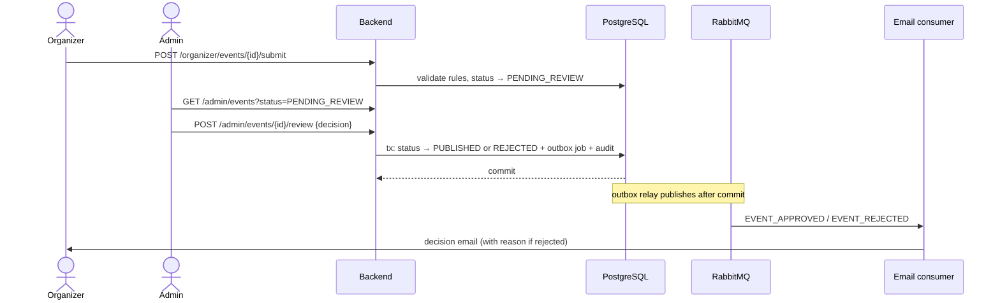
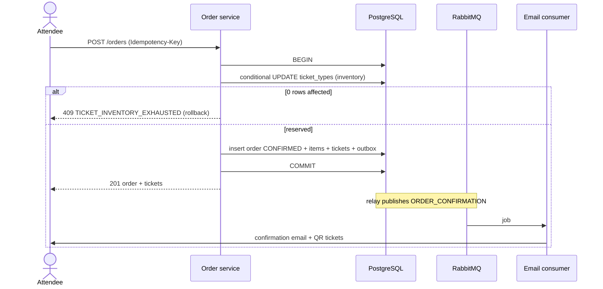
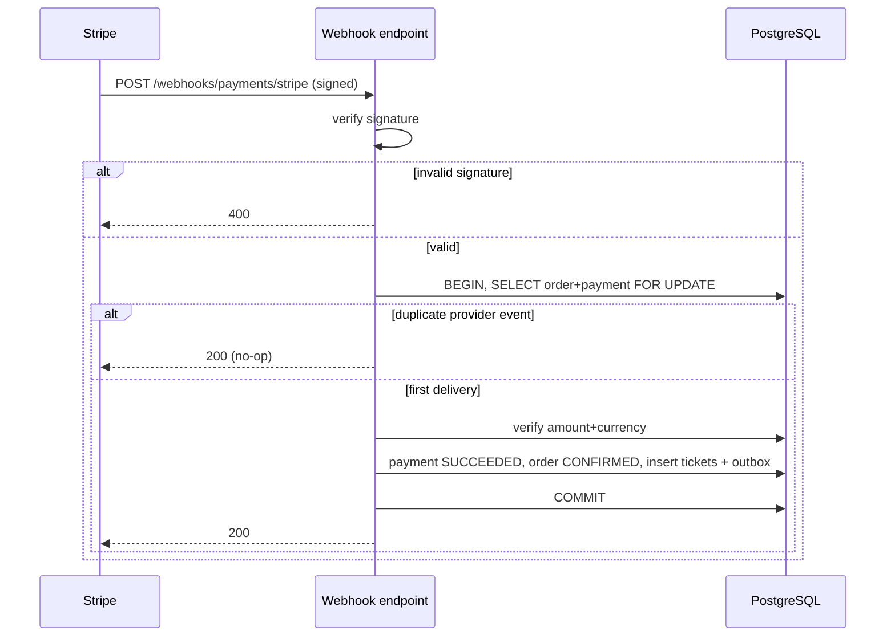
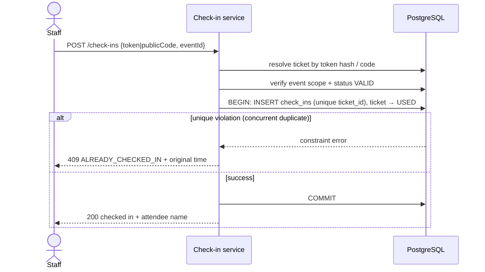
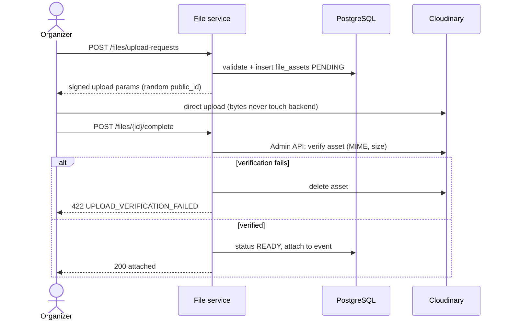

# Use Cases & Sequence Diagrams

**Version:** 1.0-draft · **Date:** 2026-07-16 · **Status:** Pending sign-off (Phase 2, Step 2.9)
**Related docs:** [requirements.md](requirements.md) · [architecture.md](architecture.md) · [api/vertical-slice.md](api/vertical-slice.md)

Eleven core use cases covering the main journeys. Template: actor, preconditions, trigger, main flow, alternate/error flows, postconditions. Critical flows include Mermaid sequence diagrams.

---

## UC-01 — Register and verify email
**Primary actor:** Visitor → Attendee · **FRs:** FR-01, FR-03, FR-18

**Preconditions:** none. **Trigger:** visitor submits the registration form.

**Main flow**
1. Visitor submits email, password, display name.
2. System validates input, normalizes email, checks uniqueness.
3. System stores the account (ACTIVE, unverified) with password hash; assigns ATTENDEE role.
4. System writes an `EMAIL_VERIFICATION` outbox job (token hash stored, 24 h TTL) in the same transaction.
5. Consumer emails the verification link; user clicks; system marks `email_verified_at`, consumes the token.

**Alternate / error flows**
- A2. Email already registered → generic "check your inbox" style response (no account enumeration).
- A3. Weak password / invalid input → 400 with field errors.
- A4. Expired/used token → 410 `TOKEN_EXPIRED`; user may request a new link (rate-limited).

**Postconditions:** account exists; verification state recorded; audit entry written.

---

## UC-02 — Log in
**Primary actor:** Any registered user · **FRs:** FR-02

**Preconditions:** account exists and is ACTIVE. **Trigger:** login form submitted.

**Main flow**
1. User submits email + password.
2. System verifies account status and password hash.
3. System creates a Redis session (rotated ID) and sets the secure cookie.
4. Response includes identity + roles for the SPA to build navigation.

**Alternate / error flows**
- A2. Wrong credentials or SUSPENDED account → identical generic 401 message.
- A3. Rate limit breached (5/min/IP or 10/h/account) → 429 + `Retry-After`.

**Postconditions:** session active; login (success and failure) audit-logged.

---

## UC-03 — Create and submit an event
**Primary actor:** Organizer · **FRs:** FR-06, FR-08, FR-21

**Preconditions:** logged in with ORGANIZER role and organizer profile. **Trigger:** "Create event".

**Main flow**
1. Organizer creates a DRAFT: title, description, category, type (physical/online), venue, timezone, start/end, registration window, capacity.
2. Organizer adds ≥ 1 ticket type (name, price LKR ≥ 0, quantity, max/order, sales window).
3. Organizer optionally uploads a banner (UC-09).
4. Organizer submits → system validates publication rules (dates coherent, venue for physical, capacity > 0, ≥ 1 valid ticket type) → status `PENDING_REVIEW`, `submitted_at` set.
5. Event appears in the admin review queue (UC-04).

**Alternate / error flows**
- A4a. Validation fails → 422 with specific codes; stays DRAFT.
- A4b. Edit while PENDING_REVIEW → not allowed (409); organizer may withdraw to DRAFT first.
- A*. Concurrent edit conflict (optimistic lock) → 409 `CONFLICT_RETRY`.

**Postconditions:** event in PENDING_REVIEW; publicly invisible; submission audit-logged.

---

## UC-04 — Review an event (approve / reject)
**Primary actor:** Administrator · **FRs:** FR-17, FR-21, FR-18

**Preconditions:** event is PENDING_REVIEW. **Trigger:** admin opens the review queue.

**Main flow**
1. Admin reviews the event detail (incl. ticket types, banner).
2. Admin approves → status `PUBLISHED`, `published_at` set; event becomes publicly discoverable.
3. System writes `EVENT_APPROVED` outbox job → organizer notified by email.

**Alternate / error flows**
- A2. Admin rejects with a required reason → status `REJECTED`; organizer notified with the reason; organizer may rework (`REJECTED → DRAFT`) and resubmit.
- A*. Two admins act concurrently → optimistic lock; second gets 409.

**Postconditions:** decision + reason audit-logged; notification enqueued.

---

## UC-05 — Order a free ticket
**Primary actor:** Attendee · **FRs:** FR-09, FR-10, FR-12, FR-18

**Preconditions:** logged in; event PUBLISHED; ticket type free (price 0), in sales window, stock available. **Trigger:** attendee confirms ticket selection.

**Main flow**
1. SPA sends `POST /orders` with `Idempotency-Key`, items, per-ticket attendee names.
2. System validates event status, sales window, per-order limit.
3. System runs the conditional inventory UPDATE (`quantity_sold + n ≤ quantity_total`).
4. In the same transaction: order (CONFIRMED) + items (price snapshot 0) + tickets (public code + token hash) + `ORDER_CONFIRMATION` outbox job.
5. Commit → response with order + tickets; consumer emails confirmation with QR tickets.

**Alternate / error flows**
- A3. Zero rows updated → 409 `TICKET_INVENTORY_EXHAUSTED`; nothing persisted.
- A2a. Outside sales window → 409 `EVENT_NOT_ON_SALE`.
- A2b. Quantity > max/order → 422 `ORDER_LIMIT_EXCEEDED`.
- A1. Same idempotency key retried → 200 with the original order (no new decrement).

**Postconditions:** inventory decremented exactly once; tickets VALID; email enqueued.

---

## UC-06 — Order a paid ticket (Stripe test mode)
**Primary actor:** Attendee · **FRs:** FR-09, FR-11

**Preconditions:** as UC-05 but price > 0. **Trigger:** attendee confirms selection and proceeds to pay.

**Main flow**
1. `POST /orders` → Transaction A: validate, reserve inventory, order `PENDING_PAYMENT` with `expires_at = now + 15 min`.
2. `POST /orders/{id}/checkout` → backend creates a Stripe Checkout Session (server-side amount) and returns the redirect URL.
3. Attendee pays on the Stripe-hosted page.
4. Stripe sends the webhook → UC-07 confirms the order and creates tickets.
5. SPA polls/returns to the order page and shows CONFIRMED with tickets.

**Alternate / error flows**
- A3a. Attendee abandons → expiration sweep cancels the order and returns inventory.
- A2. Stripe unreachable → 503 `PAYMENT_PROVIDER_UNAVAILABLE`; order stays pending; checkout retryable until expiry.
- A4. Payment fails on Stripe → payment FAILED; order remains pending until expiry.

**Postconditions:** order confirmed only via verified webhook; inventory never leaks (confirmed or returned).

---

## UC-07 — Confirm payment via webhook (system)
**Primary actor:** Stripe (system) · **FRs:** FR-11, FR-12

**Preconditions:** order PENDING_PAYMENT with a Stripe session. **Trigger:** `POST /webhooks/payments/stripe`.

**Main flow**
1. Verify signature (reject 400 if invalid — before any DB work).
2. Lock order + payment rows.
3. Duplicate provider event/payment → ack 200, no side effects.
4. Verify amount + currency against the order.
5. Payment SUCCEEDED; order CONFIRMED; tickets created **once**; `ORDER_CONFIRMATION` outbox job; commit.

**Alternate / error flows**
- A4. Amount/currency mismatch → payment flagged, order untouched, alert metric + audit; manual reconciliation.
- A2. Order already EXPIRED (late webhook) → flag for manual reconciliation; no tickets.

**Postconditions:** exactly-once confirmation; replay-safe; every outcome audit-logged.

---

## UC-08 — Check in an attendee
**Primary actor:** Event staff · **FRs:** FR-14

**Preconditions:** staff logged in and assigned to the event (or organizer/admin); event PUBLISHED; ticket VALID. **Trigger:** QR scan or manual code entry.

**Main flow**
1. Scanner reads the QR (raw validation token) or staff types the public code.
2. Optional `POST /check-ins/validate` (dry-run) shows ticket + attendee for confirmation.
3. `POST /check-ins`: resolve ticket by token hash/code; verify it belongs to the staff member's event and is VALID.
4. Transaction: insert `check_ins` row (unique ticket_id) + ticket → USED; commit.
5. Scanner shows success + attendee name.

**Alternate / error flows**
- A4. Duplicate scan (unique violation or USED state) → structured "already used" with original check-in time — never a second success.
- A3a. Ticket belongs to another event → 422 `WRONG_EVENT`.
- A3b. Ticket CANCELLED → 422 `TICKET_CANCELLED`.
- A3c. Unknown token/code → 404 `TICKET_NOT_FOUND` (forgery attempt logged).

**Postconditions:** at most one check-in per ticket, ever; all attempts audit-logged.

---

## UC-09 — Upload an event banner
**Primary actor:** Organizer · **FRs:** FR-19

**Preconditions:** organizer owns the event (DRAFT/REJECTED — editable states). **Trigger:** banner selected in the editor.

**Main flow**
1. SPA: `POST /files/upload-requests` (purpose EVENT_BANNER, MIME, size).
2. Backend validates ownership + MIME (JPEG/PNG/WebP) + size (≤ 5 MB) → `file_assets` PENDING with random public_id → returns signed Cloudinary params.
3. Browser uploads directly to Cloudinary.
4. SPA: `POST /files/{fileId}/complete` → backend verifies via Admin API (exists, MIME, size) → READY → attached as event banner.
5. Delivery uses Cloudinary transformations (compressed < 500 KB target).

**Alternate / error flows**
- A2. Disallowed MIME/size → 422 before any upload authorization.
- A4a. Verification mismatch (spoofed completion) → asset deleted, metadata DELETED, 422.
- A3. Upload abandoned → PENDING row cleaned by scheduled job.
- A5. Replacing a banner → old asset detached and deleted asynchronously.

**Postconditions:** banner served from CDN; no unverified asset ever attached.

---

## UC-10 — Export attendees as CSV
**Primary actor:** Organizer · **FRs:** FR-16

**Preconditions:** organizer owns the event with ≥ 1 attendee. **Trigger:** "Export CSV" on the dashboard.

**Main flow**
1. `POST` export request → outbox `CSV_EXPORT` job (audited) → 202 Accepted.
2. Export consumer streams attendees (name, ticket type, public code, check-in status) into a CSV.
3. CSV uploaded to Cloudinary as a **private raw asset** under `exports/{eventId}/`.
4. Organizer retrieves a short-lived signed download URL from the dashboard.

**Alternate / error flows**
- A2. Generation failure → retry with backoff → DLQ + visible "failed" status.
- A4. Expired signed URL → organizer requests a fresh URL (re-authorized + audited).

**Postconditions:** export audit-logged (who, which event, when); asset never public.

---

## UC-11 — Cancel an event
**Primary actor:** Organizer (or Admin) · **FRs:** FR-06, FR-18

**Preconditions:** event PUBLISHED (or PENDING_REVIEW). **Trigger:** "Cancel event" with confirmation.

**Main flow**
1. Organizer confirms cancellation.
2. Transaction: event → CANCELLED (`cancelled_at`); all ticket sales stop immediately; VALID tickets → CANCELLED; one `EVENT_CANCELLED` outbox job per ticket holder.
3. Consumers email all ticket holders.

**Alternate / error flows**
- A2. Event already started → 409 `EVENT_ALREADY_STARTED` (completion flow applies instead).
- Refunds: out of scope (D4) — the email states refunds are handled by the organizer off-platform.

**Postconditions:** no further orders or check-ins possible; cancellation audit-logged; notifications enqueued.
